  

  <a href="https://www.linkedin.com/in/trisha-dabral-81b40134b">LinkedIn</a>
  &nbsp;•&nbsp;
  <a href="https://leetcode.com/u/trishaha/">LeetCode</a>
  &nbsp;•&nbsp;
  <a href="mailto:trishadabral@gmail.com">Email</a>

  <a href="https://www.linkedin.com/in/trisha-dabral-81b40134b"><b>LinkedIn</b></a>
  &nbsp;&nbsp;•&nbsp;&nbsp;
  <a href="https://github.com/trishadabral"><b>GitHub</b></a>
  &nbsp;&nbsp;•&nbsp;&nbsp;
  <a href="https://leetcode.com/u/trishaha/"><b>LeetCode</b></a>
  &nbsp;&nbsp;•&nbsp;&nbsp;
  <a href="mailto:trishadabral@gmail.com"><b>Email</b></a>

